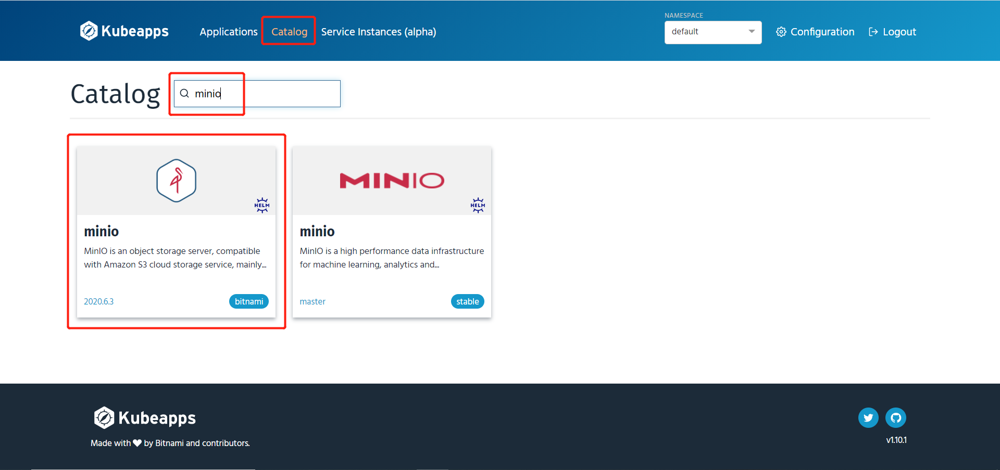
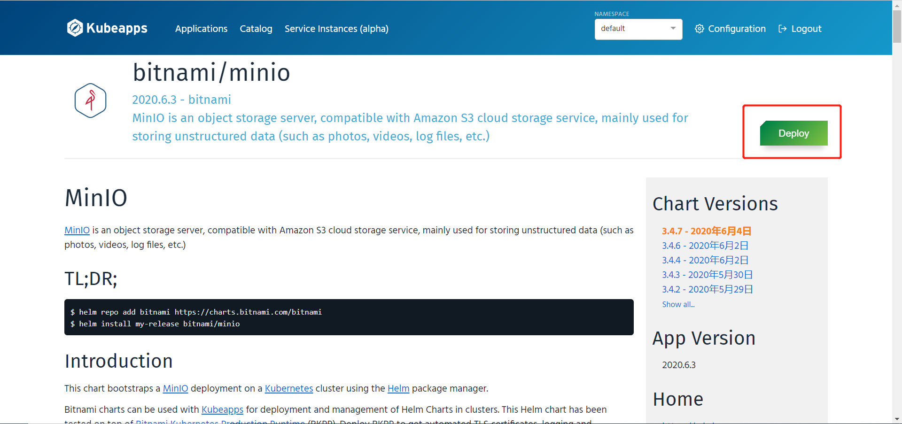
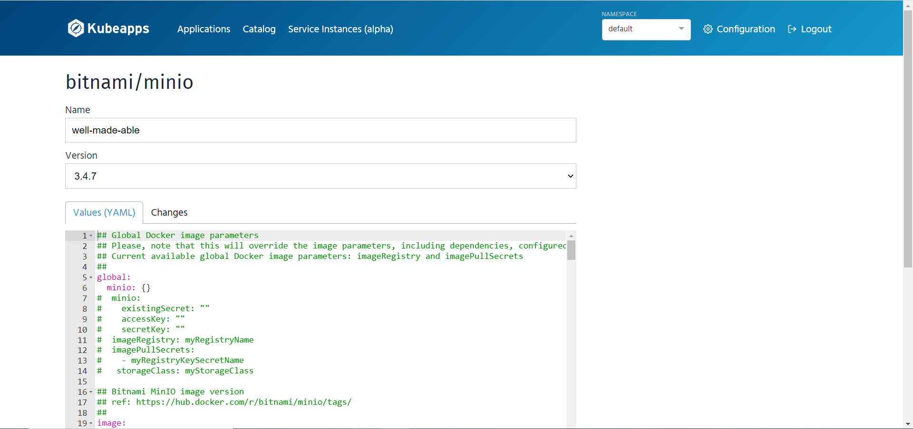
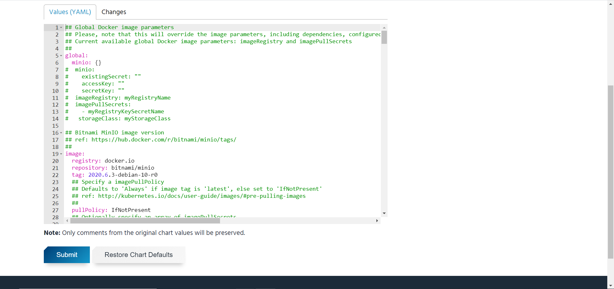
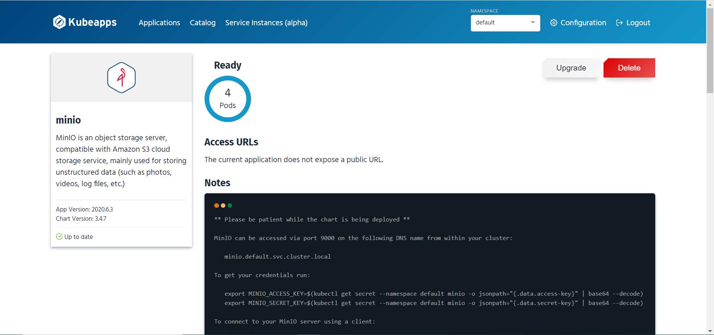
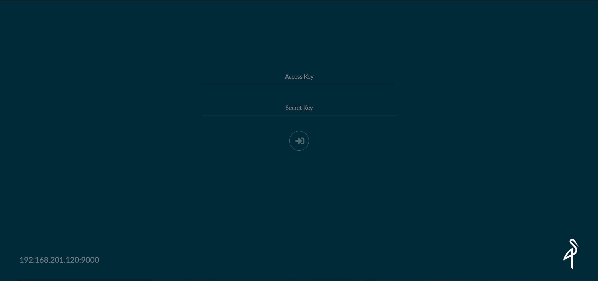
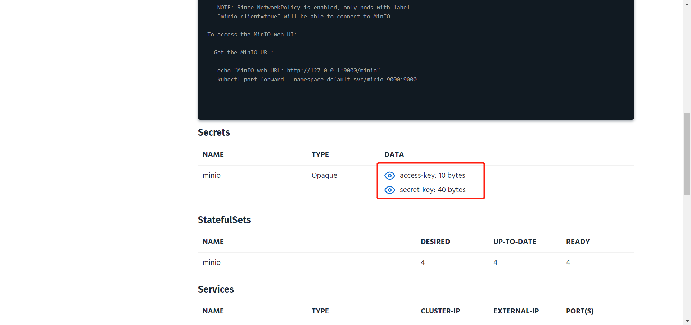

通过 helm 在 kubernetes 上安装 minio

#### 前提

- 3台服务器，CentOS7 系统
- 已安装Kubernetes环境

#### 安装helm3

1. 下载安装包 https://github.com/helm/helm/releases，选择 Linux amd64 版本

2. 安装

   ```
   tar -zxvf helm-v3.0.0-linux-amd64.tar.gz
   mv linux-amd64/helm /usr/local/bin/helm
   ```

3. 添加仓库

   ```
   helm repo add stable https://kubernetes-charts.storage.googleapis.com/
   ```

#### 安装kubeapps

1. 安装

   ```
   helm repo add bitnami https://charts.bitnami.com/bitnami
   kubectl create namespace kubeapps
   helm install kubeapps --namespace kubeapps bitnami/kubeapps --set useHelm3=true
   ```

2. 创建 Kubernetes API token

   ```
   kubectl create serviceaccount kubeapps-operator
   kubectl create clusterrolebinding kubeapps-operator --clusterrole=cluster-admin --serviceaccount=default:kubeapps-operator
   ```

3. 查看 token

   ```
   kubectl get secret $(kubectl get serviceaccount kubeapps-operator -o jsonpath='{range .secrets[*]}{.name}{"\n"}{end}' | grep kubeapps-operator-token) -o jsonpath='{.data.token}' -o go-template='{{.data.token | base64decode}}' && echo
   ```

4. 开启 Dashboard

   ```
   kubectl port-forward -n kubeapps --address 0.0.0.0 svc/kubeapps 8080:80
   ```

#### 创建minio PV

1. 创建 StorageClass

   ```
   apiVersion: storage.k8s.io/v1
   kind: StorageClass
   metadata:
     name: local-storage-minio
   provisioner: kubernetes.io/no-provisioner
   volumeBindingMode: WaitForFirstConsumer
   ```

2. 创建 minio 需要的 PV

   **这里在 k8s的2个 worker 节点上创建了4个pv，因为minio分布式最少需要4个节点，所里这里在2个worker节点上分别创建了2个存储目录。**

   ```
   apiVersion: v1
   kind: PersistentVolume
   metadata:
     name: local-storage-minio-0
   spec:
     capacity:
       storage: 2Gi
     accessModes:
     - ReadWriteOnce
     persistentVolumeReclaimPolicy: Retain
     storageClassName: local-storage-minio
     local:
       path: /localdata/minio/data-0
     nodeAffinity:
       required:
         nodeSelectorTerms:
         - matchExpressions:
           - key: kubernetes.io/hostname
             operator: In
             values:
             - node2
   ---
   apiVersion: v1
   kind: PersistentVolume
   metadata:
     name: local-storage-minio-1
   spec:
     capacity:
       storage: 2Gi
     accessModes:
     - ReadWriteOnce
     persistentVolumeReclaimPolicy: Retain
     storageClassName: local-storage-minio
     local:
       path: /localdata/minio/data-1
     nodeAffinity:
       required:
         nodeSelectorTerms:
         - matchExpressions:
           - key: kubernetes.io/hostname
             operator: In
             values:
             - node2
   ---
   
   apiVersion: v1
   kind: PersistentVolume
   metadata:
     name: local-storage-minio-2
   spec:
     capacity:
       storage: 2Gi
     accessModes:
     - ReadWriteOnce
     persistentVolumeReclaimPolicy: Retain
     storageClassName: local-storage-minio
     local:
       path: /localdata/minio/data-2
     nodeAffinity:
       required:
         nodeSelectorTerms:
         - matchExpressions:
           - key: kubernetes.io/hostname
             operator: In
             values:
             - node3
   ---
   apiVersion: v1
   kind: PersistentVolume
   metadata:
     name: local-storage-minio-3
   spec:
     capacity:
       storage: 2Gi
     accessModes:
     - ReadWriteOnce
     persistentVolumeReclaimPolicy: Retain
     storageClassName: local-storage-minio
     local:
       path: /localdata/minio/data-3
     nodeAffinity:
       required:
         nodeSelectorTerms:
         - matchExpressions:
           - key: kubernetes.io/hostname
             operator: In
             values:
             - node3
   ```

3. 手动创建PV目录

   ```
   # node2
   mkdir -p /localdata/minio/data-0
   mkdir -p /localdata/minio/data-1
   
   # node3
   mkdir -p /localdata/minio/data-2
   mkdir -p /localdata/minio/data-3
   ```

#### kubeapps 部署 minio

1. 搜索 Chart，选择 bitnami 仓库的 Chart

   

2. 部署

   

3. 安装

   

4. 修改Values的一些属性

   | 属性                        | 原始值     | 新值                                              | 说明                                                         |
   | --------------------------- | ---------- | ------------------------------------------------- | ------------------------------------------------------------ |
   | mode                        | standalone | distributed                                       | 集群模式                                                     |
   | resources.requests          | {}         | requests:<br/>    cpu: 250m<br/>    memory: 256Mi |                                                              |
   | persistence.size            | 8Gi        | 1Gi                                               | 该值修改为 minio PV 的一半，如果设置成一样大，有可能出现自动创建的 PVC 无法绑定的情况。 |
   | persistence.storageClass    | "-"        | local-storage-minio                               |                                                              |
   | networkPolicy.enabled       | false      | true                                              |                                                              |
   | networkPolicy.allowExternal | true       | false                                             |                                                              |

   具体参数请参考官方文档：https://github.com/bitnami/charts/tree/master/bitnami/minio

5. 点击下方的 Submit 按钮提交

   

6. 等待部署完成，即4个Pod都Ready的时候

   

7. 开启minio WebUI

   ```
   kubectl port-forward --address 0.0.0.0 svc/minio 9000:9000
   ```

8. 访问

   

   账号密码可以通过minio 详情页面查看

   